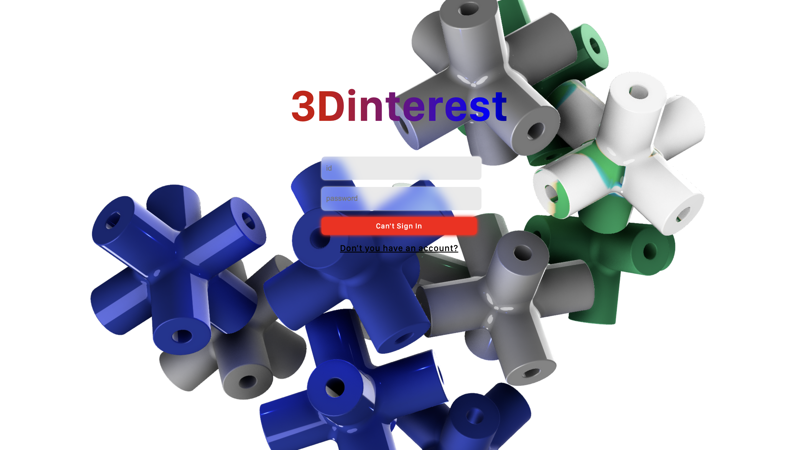

# FE-3Dinterest
## 구성원
* 충북대학교 소프트웨어학부 2학년 최현철 1인 프론트엔트 프로젝트

## 프로젝트 주제 
3D 모델을 사용하는 요즘의 웹 디자인 트랜드에 따라 3D 모델을 취급하는 Pinterest 클론 프로젝트의 FE 리포지토리입니다.
## 프로젝트 설정 내용 
* 빠른 설정 등의 속도를 위해 vite 사용(동아리 선배 추천)
* 프레임워크는 React 사용
* 3D 모델링 기반의 웹 디자인을 위해 Three.js 사용
* ... 더 추가 예정

## 협업 방식
* 이슈 관리는 노션 워크스페이스를 이용 (정해진 양식에 따라, 추후 공부를 위한 프로젝트 이슈 문서화)
* 프론트 리포지토리는 혼자서 하므로 정해진 양식 없이 커밋 및 풀리퀘 (적당히 구현한 내용만 적어놓는다.)

## 사용 오픈소스
* styled-component
* r3f, ThreeJS
* framework react

## 페이지

