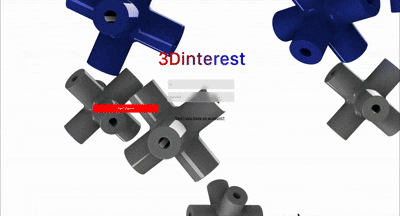
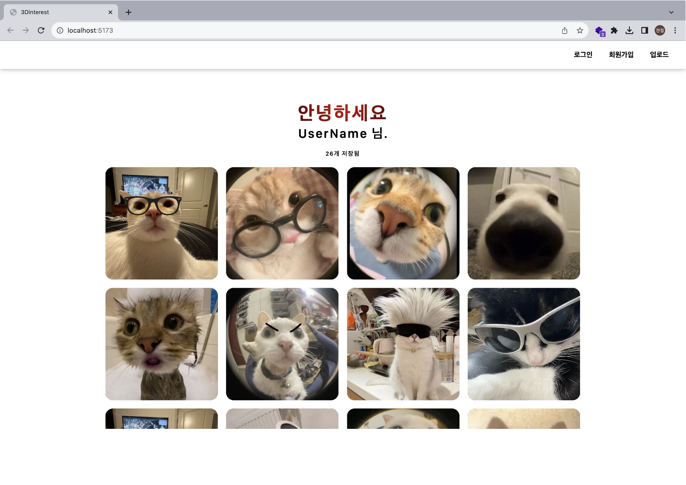
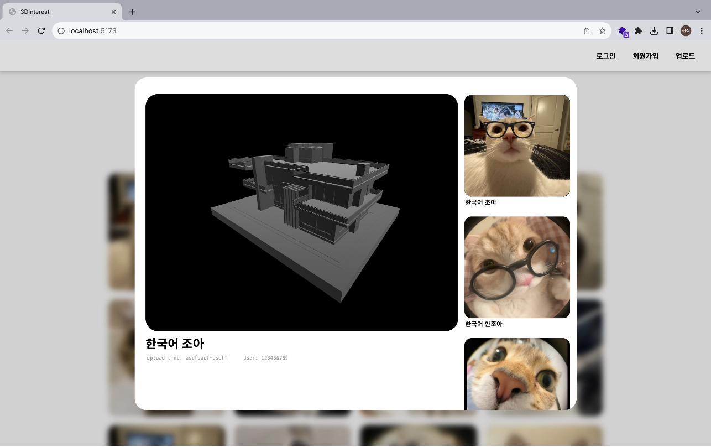

# 3Dinterest : 3D 모델 특화 이미지 큐레이션 서비스 (Pinterest Clone)
최근 웹 디자인 트렌드에서 3D 요소의 활용이 급증하고 있습니다. **3D-interest**는 단순한 2D 이미지를 넘어, 3D 모델 파일(GLTF/GLB 등)을 렌더링하고 유저들과 공유할 수 있는 3D 특화 핀터레스트 클론 프로젝트입니다. 

### 프로젝트 개요
- 개발 기간: 2023.09 ~ 2023.12
- 개발 인원: 3인 교내 팀 프로젝트

## 사용 기술 스택

**Frontend**
- Core: React, Vite
- 3D Graphics: Three.js, @react-three/fiber (R3F), @react-three/drei
- State Management: Zustand (보일러플레이트를 최소화한 전역 상태 관리)
- Styling: styled-components
- Network: Axios

**Tooling**
- MSW (Mock Service Worker를 활용한 API 모킹 및 독립적인 FE 개발 환경 구축)


## 주요 기능

### 1. 3D 뷰어 갤러리
- Three.js와 React Three Fiber를 활용해 웹 브라우저 상에서 3D 모델을 부드럽게 렌더링합니다.
- 사용자는 마우스를 드래그하여 3D 모델을 회전시키고 다양한 각도에서 확인할 수 있습니다.

### 2. 사용자 인증
- 회원가입 및 로그인 흐름 구현
- 사용자 입력 값에 대한 즉각적인 유효성 검증(Validation) 및 Inline Error 처리를 통한 UX 개선

### 3. 게시물 인터랙션
- 3D 모델 게시물 렌더링 및 좋아요(Like), 다운로드 등의 핀터레스트 핵심 인터랙션 구현
- 핵심 기능 중 하나인 컨트리뷰트를 통해 다른 게시글에 대해 2차 창작을 할 수 있도록 구현


## 스크린샷

### 로그인
<p align=center>

</p>


### 메인페이지
<p align=center>

</p>

### 게시글 상세 페이지
<p align=center>

</p>


## Trouble Shooting


**1. 3D 모델 로딩 성능 최적화 문제**
- 문제: 크기가 큰 GLTF 파일을 여러 개 로드할 때 초기 렌더링이 심하게 지연되는 현상 발생.
- 해결: `@react-three/drei`의 `<Suspense>`와 로딩 스피너를 결합하여 사용자에게 피드백을 제공하고, 모델 리소스 압축 및 비동기 렌더링을 통해 체감 로딩 시간을 단축.

**2. 전역 상태 관리 구조 설계**
- **문제**: 로그인 유저 정보와 현재 렌더링 중인 모델의 상태가 여러 컴포넌트(Header, Feed, Modal)에 걸쳐 필요하여 Prop Drilling 발생.
- **해결**: `Zustand`를 도입하여 UserStore, ModelStore로 상태를 분리해 컴포넌트 간 결합도를 낮추고 렌더링 효율을 높임.

---

## Run

이 프로젝트는 Vite를 사용하고 있으며 모의 서버(MSW)가 설정되어 있습니다.

```bash
# 의존성 설치
$ npm install

# 개발 서버 실행
$ npm run dev